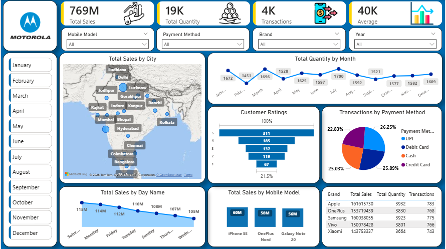

# 📱 Mobile Sales Performance Analysis Dashboard

## 📊 Project Overview
This project analyzes mobile phone sales data using **Power BI**, **Power Query**, and **DAX** to uncover sales trends, brand performance, customer behavior, and revenue insights.

The dashboard provides interactive visualizations and KPI tracking to help identify top-performing mobile brands, cities, and payment methods.

---

## 🖥️ Dashboard Preview



---

## 📈 Key Insights
- Apple generated the highest overall revenue
- UPI was the most preferred payment method
- Major cities contributed the highest sales volume
- Customer ratings helped identify top-performing mobile models
- Weekly sales trends revealed peak purchasing periods

---

## 🛠️ Tools Used
- Power BI
- Power Query
- DAX
- Microsoft Excel

---

## 📂 Repository Structure

```bash
mobile-sales-analysis/
│
├── Data/
├── Report/
├── Screenshots/
├── Scripts/
└── README.md
```

---

## 🚀 How to Run
1. Clone this repository
2. Open `Mobile_sales_dashboard.pbix` in Power BI Desktop
3. Update data source paths if required

---

## 📌 Features
- KPI Cards for Sales, Quantity, and Ratings
- Interactive Slicers and Filters
- Sales Trend Analysis
- Brand & City-wise Performance Tracking
- Customer Insights Dashboard
